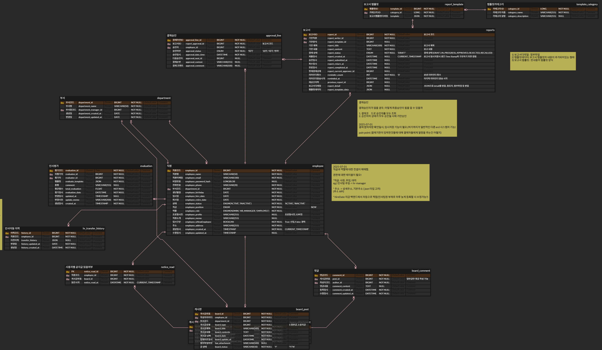

## 👥 Team Members

|  |  |  |  |
| :-------------------------------------------------------------------------------------------------------------------------------------: | :-----------------------------------------------------------------------------------------------------------------------------------: | :-------------------------------------------------------------------------------------------------------------------------: | :---------------------------------------------------------------------------------------------------------------------------------: |
|                                                [김지원](https://github.com/kimjiwon0450)                                                |                                               [도진호](https://github.com/wlsgh147258)                                                |                                             [이도현](https://github.com/ehgus8)                                             |                                               [윤하준](https://github.com/Petrushhka)                                               |

# 1. 프로젝트 개요

## 1.1 목적

본 시스템은 패션 관련 회사의 내부 업무 효율화와 정보 통합을 위해,
직원, 공지, 전자결재 등 사내 핵심 업무를 디지털화한 ERP 플랫폼이다.

## 1.2 개발 범위

- 관리자 및 일반 직원이 사용하는 **내부 사내 시스템**
- PC/웹 기반 관리자 시스템 (모바일 미포함)
- 회사별 맞춤화 고려, 단 사내 공통 업무가 메인

---

# 2. 시스템 개요

## 2.1 시스템 구성도 (서비스 분리)

| 서비스명         | 설명                                         |
| ---------------- | -------------------------------------------- |
| hr-service       | 직원 정보, 부서/직책 관리, 입/퇴사, 인사평가 |
| notice-service   | 공지사항, 업무보고                           |
| approval-service | 전자결재                                     |

---

# 3. 사용자 정의

| 역할     | 권한                                |
| -------- | ----------------------------------- |
| 관리자   | 전체 직원/공지/시스템 관리          |
| 인사팀   | 직원정보, 공지 관리                 |
| 팀장     | 팀원 정보, 팀 공지/보고서 확인/결재 |
| 일반직원 | 자신의 인사평가 확인, 보고서 제출   |

---

# 4. 요구사항 정의서

## 4.1 직원(인사) 서비스

| 기능명             | 설명                               | 입력값                                        | 출력값               | 비고(주요 정책)              |
| ------------------ | ---------------------------------- | --------------------------------------------- | -------------------- | ---------------------------- |
| 직원 등록          | 신규 직원 정보 등록                | 이름, 연락처, 직책, 부서, 입사일, 급여조건 등 | 직원ID               | 사번/직원ID 자동 생성        |
| 직원 수정          | 기존 직원 정보 수정                | 직원ID, 변경필드                              | 성공/실패 메시지     | 권한 필요(관리자/인사팀)     |
| 직원 삭제          | 퇴사자 정보 처리                   | 직원ID                                        | 성공/실패 메시지     | 퇴사일 처리, 논리삭제        |
| 직원 목록 조회     | 전체 직원/조건별 목록 조회         | 검색조건(부서/직책 등)                        | 직원 리스트          | 페이징/검색 지원             |
| 상세정보 조회      | 특정 직원의 상세 정보              | 직원ID                                        | 직원 상세정보        |                              |
| 부서/직책 관리     | 부서/직책 등록/수정/삭제           | 부서명, 직책명 등                             | 성공/실패 메시지     | 권한 필요(관리자)            |
| 인사평가 등록/수정 | 개별 평가 점수/코멘트 입력 및 수정 | 평가계획ID, 평가대상ID, 평가자ID, 점수, 의견  | 성공/실패 메시지     | 평가자 권한                  |
| 인사평가 결과 조회 | 개인별/조직별 평가 결과 확인       | 검색조건(직원ID, 기간, 부서 등)               | 평가결과 리스트/상세 | 본인/팀장/관리자별 접근 제한 |
| 인사평가 이력 조회 | 본인/조직의 평가 이력 조회         | 직원ID, 기간, 평가항목 등                     | 평가이력 리스트      |                              |
| 인사평가 결과 연동 | 평가 결과를 보상, 승진 등과 연동   | 평가ID, 연동대상(급여/승진 등)                | 성공/실패 메시지     | 인사팀/관리자만 가능         |

---

## 4.2 공지/게시판 서비스

| 기능명        | 설명                  | 입력값                 | 출력값      | 비고(주요 정책)  |
| ------------- | --------------------- | ---------------------- | ----------- | ---------------- |
| 공지사항 등록 | 사내 공지 작성/등록   | 제목, 내용, 첨부파일   | 공지ID      | 관리자만 가능    |
| 공지사항 조회 | 전체/조건별 공지 목록 | 검색조건(부서,기간 등) | 공지 리스트 | 페이징 지원      |
| 게시판        | 부서/팀별 게시판 운영 | 제목, 내용, 첨부파일   | 게시글ID    | 부서별 접근 권한 |

## 4.3 보고서/결재 서비스

| 기능명        | 설명                           | 입력값                       | 출력값           | 비고(주요 정책)       |
| ------------- | ------------------------------ | ---------------------------- | ---------------- | --------------------- |
| 보고서 작성   | 업무보고/건의/사건 보고서 작성 | 직원ID, 제목, 본문, 결재자ID | 보고서ID         | 결재자 지정 필수      |
| 보고서 조회   | 보고서 목록/상세 확인          | 검색조건(작성자,기간 등)     | 보고서 리스트    | 결재상태, 기간별 검색 |
| 보고서 결재   | 보고서 결재(승인/반려 처리)    | 보고서ID, 승인여부, 의견     | 성공/실패 메시지 | 결재자 권한만 가능    |
| 결재이력 조회 | 결재 이력/상세 확인            | 보고서ID                     | 결재이력 리스트  | 승인/반려 사유 표시   |

---

# 5. 시스템 아키텍처

---

# 6. ERD

---

# 7. WBS (Work Breakdown Structure)

| WBS 번호 | 작업명                       | 담당자         | 기간        | 산출물                   | 비고 |
| -------- | ---------------------------- | -------------- | ----------- | ------------------------ | ---- |
| 1        | 기획 및 분석                 | 전체           | 6/20 ~ 6/30 | 요구사항정의서           |      |
| 1.1      | ㆍ요구사항 정의              | 전체           | 6/20 ~ 6/30 | 요구사항정의서           |      |
| 1.2      | ㆍ시스템 아키텍처 설계       | 전체           | 6/20 ~ 6/30 | 아키텍처도               |      |
| 1.3      | ㆍWBS/일정/자원계획          | 전체           | 6/20 ~ 6/30 | WBS 문서                 |      |
| 2        | 개발환경 및 인프라 구축      | 이도현         | 6/30        | 개발환경세팅             |      |
| 2.1      | ㆍ서버/DB 세팅               | 이도현         | 6/30        | DB/서버 환경             |      |
| 2.2      | ㆍ형상관리(Git 등)           | 전체           | 6/30        | Git 저장소               |      |
| 3        | 공통 모듈 및 프레임워크 개발 | 이도현         | 6/30        | 공통 모듈                |      |
| 3.1      | ㆍ로그인/권한 관리           | 이도현         | 6/30        | 인증/인가 모듈           |      |
| 3.2      | ㆍUI 템플릿/디자인 시스템    | 이도현         | 6/30        | UI 템플릿, 공통 컴포넌트 |      |
| 3.3      | ㆍ공통 라이브러리/유틸       | 이도현         | 6/30        | 공통 함수/라이브러리     |      |
| 4        | 서비스별 백엔드 개발         | 각 담당        | 6/30 ~ 7/18 | 서비스별 API             |      |
| 4.1      | ㆍ직원(인사) 서비스 개발     | 이도현, 윤하준 | 6/30 ~ 7/18 | 인사 서비스              |      |
| 4.2      | ㆍ공지/게시판 서비스 개발    | 김지원         | 6/30 ~ 7/18 | 게시판/알림              |      |
| 4.3      | ㆍ보고서/결재 서비스 개발    | 도진호         | 6/30 ~ 7/18 | 보고서/결재              |      |
| 5        | 프론트엔드(UI) 개발          | 전체           | 6/30 ~ 7/31 | UI/화면                  |      |
| 5.1      | ㆍ메인/전체 레이아웃 구현    | 전체           | 6/30 ~ 7/10 | 전체 레이아웃            |      |
| 5.2      | ㆍ주요 화면(직원/공지 등)    | 각 담당        | 6/30 ~ 7/17 | 각종 화면                |      |
| 5.3      | ㆍ상세/수정/검색/모달        | 각 담당        | 6/30 ~ 7/22 | 각종 UI 기능             |      |
| 5.4      | ㆍ프론트엔드 테스트          | 전체           | 7/23 ~ 7/31 | 테스트 결과              |      |
| 6        | 테스트 및 통합               | 전체           | 8/1 ~ 8/5   | 통합 테스트 결과         |      |
| 6.1      | ㆍ단위 테스트                | 전체           | 8/1 ~ 8/3   | 단위테스트 결과          |      |
| 6.2      | ㆍ통합 테스트                | 전체           | 8/3 ~ 8/5   | 통합테스트 결과          |      |
| 6.3      | ㆍ사용자 시나리오 테스트     | 전체           | 8/5 ~ 8/6   | 시나리오 결과            |      |
| 7        | 배포 및 운영                 | 전체           | 8/6 ~ 8/8   | 배포본/운영환경          |      |
| 7.1      | ㆍ초기 데이터 이관           | 전체           | 8/6         | 데이터 이관 결과         |      |
| 7.2      | ㆍ시스템 배포                | 전체           | 8/7         | 배포본                   |      |
| 7.3      | ㆍ운영환경 점검 및 핫픽스    | 전체           | 8/8         | 점검/패치 내역           |      |
| 8        | 최종 검수 및 마감            | 전체           | 8/8 ~ 8/10  | 산출물/최종보고서        |      |
| 8.1      | ㆍ최종 산출물 정리           | 전체           | 8/8 ~ 8/9   | 산출물 정리본            |      |
| 8.2      | ㆍ최종 보고서/매뉴얼 작성    | 전체           | 8/8         | 최종보고서/매뉴얼        |      |
| 8.3      | ㆍ최종 회고 및 마무리        | 전체           | 8/9         | 회고록                   |      |
| 9        | 결과 발표 및 유지보수        | 전체           | 8/12 ~ 8/13 | 발표자료/유지보수        |      |
| 9.1      | ㆍ최종 발표 준비/실시        | 전체           | 8/12 ~ 8/13 | 발표자료                 |      |

# 8. 화면설계서

## 8.1 대시보드 페이지

## 8.1 알림 페이지

## 8.2 로그인 및 비밀번호설정 페이지

## 8.3 직원리스트 페이지

## 8.4 결재 페이지

## 8.5 공지 페이지

## 8.6 인사관리 페이지

## 8.7 인사평가 페이지

